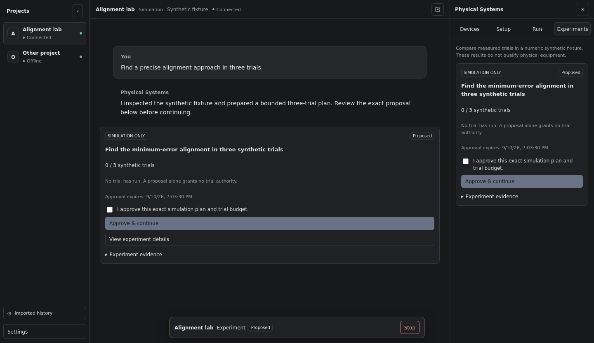

<p align="center">
  <a href="https://physicalsystems.ai">
    
  </a>
</p>

<h1 align="center">Physical Systems Desktop</h1>

<p align="center">
  The open-source agent workspace for physical systems.
</p>

<p align="center">
  <a href="https://physicalsystems.ai">Website</a> ·
  <a href="https://physicalsystems.ai/download">Download</a> ·
  <a href="packages/physicalsystems/README.md">Developer guide</a> ·
  <a href="packages/physicalsystems/QUALIFICATION.md">Qualification status</a>
</p>



Physical Systems Desktop brings projects, agent conversations, device status,
workcell controls, and experiment approval into one application. It is built on
the open source [OpenCode](https://github.com/anomalyco/opencode) agent and
desktop client, with a Physical Systems operator layer that owns the boundary to
real equipment.

## What you can do

- Keep conversations and workcell context together inside a project.
- Connect a configured Physical Systems Node locally or over SSH.
- Discover devices and inspect their reported capabilities and setup blockers.
- Preview an explicitly selected camera from the Devices panel.
- Ask the agent to inspect a system, plan an approach, and propose an experiment.
- Review and approve the exact proposed scope before execution.
- Run synthetic experiments without connecting physical equipment.
- Continue the same conversation from the desktop and an attached terminal.

The current public release is a preview. See the
[qualification record](packages/physicalsystems/QUALIFICATION.md) for the exact
automated, simulated, and native checks that have passed, along with the areas
that have not been verified on real hardware.

## Install the preview

Download the current Windows or Linux installer from
[physicalsystems.ai/download](https://physicalsystems.ai/download).

| Platform          | Package     | Notes                                                                       |
| ----------------- | ----------- | --------------------------------------------------------------------------- |
| Windows x64       | `.exe`      | The current preview is unsigned, so Windows may warn or block installation. |
| Ubuntu/Debian x64 | `.deb`      | Recommended Linux package.                                                  |
| Linux x64         | `.AppImage` | Advanced option with an explicit Ubuntu AppArmor prerequisite.              |

For commands, checksums, removal, and AppImage setup, read the
[installation guide](release/install-desktop.md). macOS installers are not yet
published.

The app shows its installed version at the bottom-left of **Settings**. Open
Settings with <kbd>Ctrl</kbd>+<kbd>,</kbd> on Windows or Linux. Authenticated
in-app updates remain disabled until the signing and installation lifecycle is
qualified; use the download page to check for a newer preview.

## How it is structured

```text
Physical Systems Desktop
├── OpenCode agent, conversations, providers, models, and terminal
├── Physical Systems project and workcell interface
└── Physical Systems operator
    └── Physical Systems Node
        └── cameras, robots, compute, and instruments
```

The renderer receives a narrow, typed view of operator state. The operator owns
device credentials, operation records, and execution authority. The agent can
inspect and propose work through reviewed tools, but a proposal or chat message
does not grant hardware authority.

The bundled operator is generated from the canonical
[PhysicalSystems/physicalsystems](https://github.com/PhysicalSystems/physicalsystems)
repository. Its source revision and artifact hashes are recorded in
[`packages/physicalsystems/vendor/manifest.json`](packages/physicalsystems/vendor/manifest.json).

## Safety model

- Creating or selecting a project does not connect a Node or start a capture.
- A camera opens only after the operator selects it and presses **Start preview**.
- Basic camera preview does not require robot commissioning.
- Robot execution uses its own preparation and exact approval boundaries.
- Stop and recovery remain available independently of an ordinary assistant request.
- Synthetic experiment results do not establish robot performance or readiness.

Do not bypass an approval or ownership check to complete a test. Treat an
unconfirmed outcome as unresolved and inspect it through the original operation
owner.

## Development

This repository is the Physical Systems fork of OpenCode. It contains the
Electron desktop app, SolidJS interface, OpenCode agent runtime, the Physical
Systems adapter, and a pinned generated operator artifact. It does not contain
the private Node implementation or device drivers.

The repository pins Bun in `package.json`. Install dependencies from the root:

```sh
bun install --frozen-lockfile
```

The Physical Systems review build requires explicit operator and model-catalog
inputs. Follow the [developer build and launch guide](packages/physicalsystems/README.md#developer-build-and-launch)
instead of the upstream OpenCode launch commands. That workflow uses a dedicated
data directory and keeps device access disabled for simulation review.

Run checks from the affected package rather than the repository root:

```sh
cd packages/physicalsystems
bun test src
bun typecheck
```

Additional app, desktop, browser, and release checks are documented in the
[developer guide](packages/physicalsystems/README.md) and
[release guide](release/README.md).

## Releases

Desktop releases use a separate version sequence and are built for Windows x64
and Linux x64. The release pipeline binds installers to an exact source revision,
qualification record, and SHA-256 inventory before publishing them to
[PhysicalSystems/physicalsystems releases](https://github.com/PhysicalSystems/physicalsystems/releases).
The website selects only a reviewed public release.

Read the [release process](release/README.md),
[public build contract](release/public-build.md), and
[protected publisher contract](release/public-publisher.md) before changing
packaging or publication code.

## Open source and attribution

Physical Systems Desktop builds on [OpenCode](https://github.com/anomalyco/opencode).
Upstream OpenCode code remains under its MIT license and copyright. The
Physical Systems integration is Apache-2.0. Third-party notices and the generated
operator's provenance are included with packaged applications.

See [`LICENSE`](LICENSE),
[`packages/physicalsystems/LICENSE`](packages/physicalsystems/LICENSE), and the
bundled operator [`NOTICE`](packages/physicalsystems/vendor/NOTICE).
